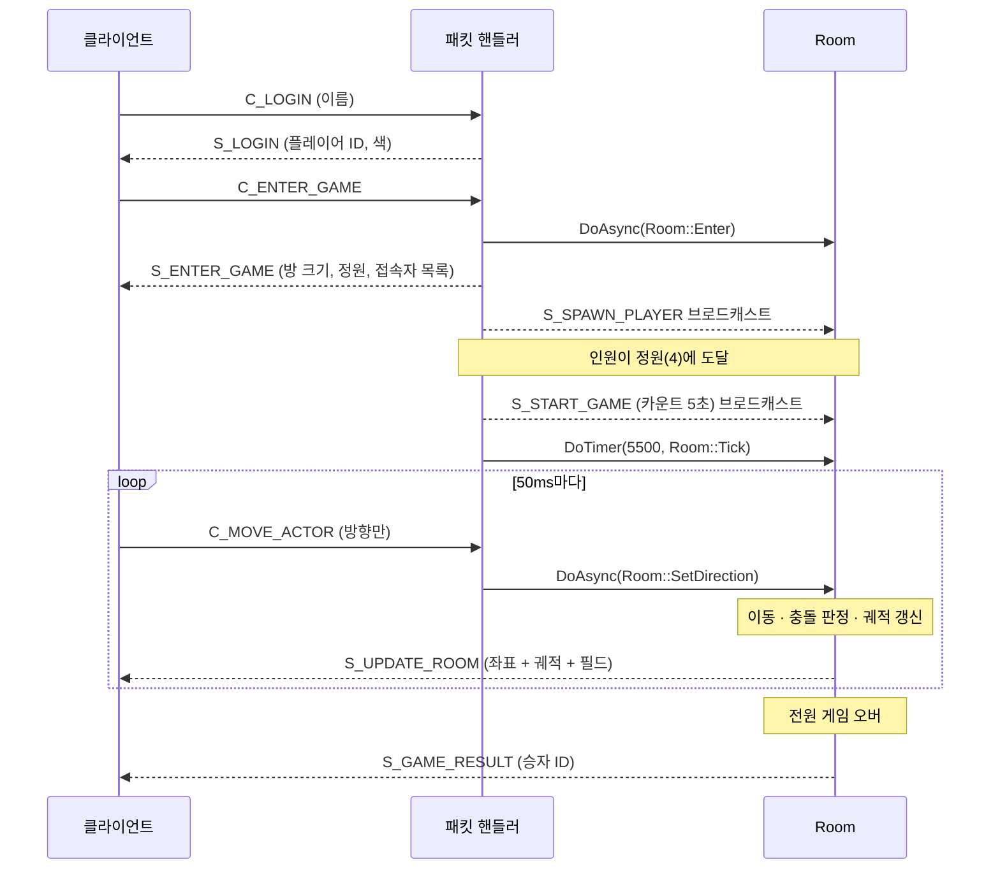
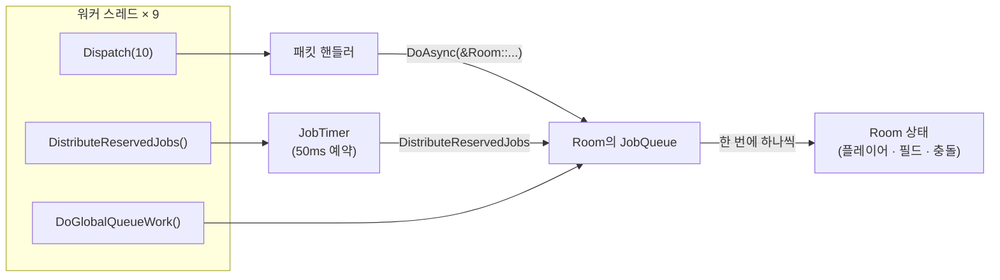
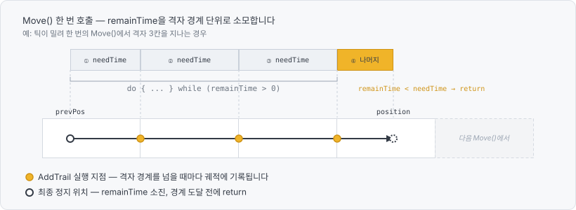
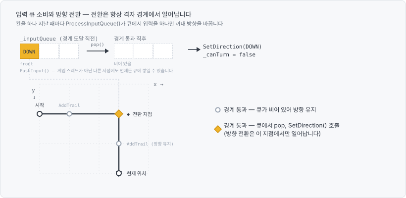
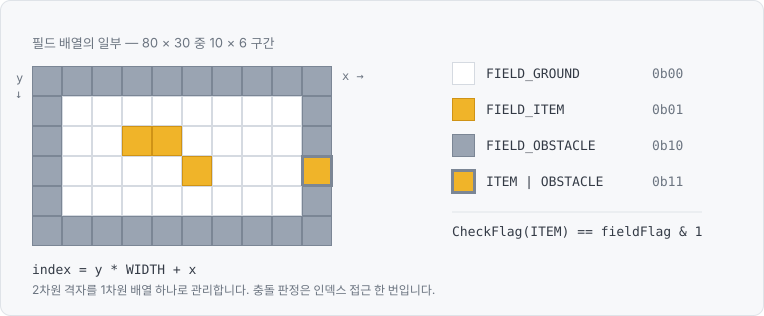
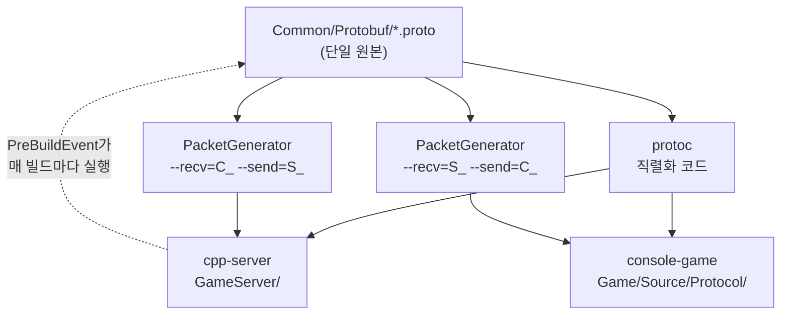

# 콘솔 멀티플레이 스네이크 — 게임 서버

콘솔 화면에서 동작하는 4인 멀티플레이 스네이크 게임의 **전용 게임 서버**입니다. IOCP 서버 코어 위에 이동·충돌 판정·방 관리 같은 서버 권위적으로 게임 로직을 처리합니다.

> ### 클라이언트 저장소
>
> 이 서버에 연결되는 클라이언트는 **[console-game](https://github.com/chibi1541/console-game)** 에 있습니다.
> 실행 화면, 렌더링 구조, 서버 상태를 받아 보간해 그리는 방식은 그쪽 문서에서 자세히 다룹니다.
> 이 프로젝트의 프로토콜 생성 스크립트가 생성 결과를 클라이언트 쪽으로 복사하기 때문에 두 저장소는 같은 부모 폴더가 일치해야 합니다.

---

## 프로젝트 소개

| 구성 | 레포지토리 | 역할 |
|---|---|---|
| 클라이언트 | [console-game](https://github.com/chibi1541/console-game) | 콘솔 렌더링, 입력 전송, 서버 상태 복제 |
| 게임 서버 | cpp-server (현재 레포) | 게임 로직, 충돌 판정, 상태 브로드캐스트 |
| 게임 엔진 | CraftEngine | 콘솔 렌더러, 액터/레벨, 입력 (Submodule · 비공개) |
| 서버 코어 | ServerCore | IOCP, 세션, Job 큐 (Submodule · 비공개) |

게임 엔진과 서버 코어는 이 프로젝트를 위해 직접 만든 것이지만, 게임 프로젝트와 함께 관리하지 않고 각각 독립적으로 관리하기 위해 두 모듈을 별도 저장소(비공개)로 두고 Submodule 형태로 연결하였습니다. 이 서버 레포는 그 위에서 방(`Room`) 상태 관리, 이동·충돌 판정, 클라이언트로의 상태 브로드캐스트를 담당합니다.

---

## 게임 흐름

방(`Room`)은 하나이고 정원은 4명입니다. 4명이 모이면 카운트다운 뒤에 게임이 시작되고, 전원이 게임 오버되면 점수가 가장 높았던 사람이 승자가 됩니다. 접속에서 종료까지 오가는 패킷은 다음과 같습니다.



시작 위치는 서버가 무작위로 정하고(`x` 3\~77, `y` 3\~27), 시작 방향은 화면 중앙을 기준으로 안쪽을 향하게 잡습니다. 카운트다운 숫자는 클라이언트가 직접 그리고, 서버는 남은 시간만 알려준 뒤 자신은 5.5초 뒤에 첫 틱이 돌도록 예약합니다. 카운트가 끝나는 시점과 뱀이 움직이기 시작하는 시점을 맞추기 위한 처리입니다.

---

## 기술 스택

| 구분 | 내용 |
|---|---|
| 언어 | C++17 |
| 툴셋 | MSVC v145 / x64 |
| 네트워크 | ServerCore — IOCP, 세션, Job 큐 (직접 제작, 서브모듈 · 비공개) |
| 직렬화 | Protobuf |
| 코드 생성 | Python 3 + jinja2 |

- **별도의 ServerCore Lib** : IOCP 입출력, 세션 관리, Job 큐, 메모리 풀은 ServerCore가 담당하고 이 저장소에는 게임 로직만 있습니다. 서브모듈로 연결되어 있지만 비공개 저장소라 내려받기는 불가능하지만 필요한 헤더와 `.lib`은 `Libraries/`에 함께 담아 두었으므로 해당 저장소만의 구성만으로 빌드가 가능합니다.
- **Protobuf** : `.proto` 하나를 파싱해 서버·클라이언트 양쪽의 패킷 핸들러를 만들어내는 구조라, 스키마가 곧 두 프로젝트의 계약이 됩니다. 이 생성 파이프라인은 이 레포(`Common/Protobuf`, `Tools/PacketGenerator`)에 있습니다.

---

## 목차

- **[스레드 모델](#스레드-모델)** 
  - [스레드 간의 경합](#스레드-간의-경합)
  - [서버 스레드의 스케쥴링](#서버-스레드의-스케쥴링)
  - [아쉬운 점](#아쉬운-점)
- **[동기화 모델 (지연 보간 방식)](#동기화-모델-지연-보간-방식)**
  - [모델 선택 이유](#모델-선택-이유)
- **[이동과 입력](#이동과-입력)**
  - [격자 단위 이동 루프](#격자-단위-이동-루프)
  - [입력 큐와 방향 전환 시점](#입력-큐와-방향-전환-시점)
  - [몸통의 궤적 표현](#몸통의-궤적-표현)
  - [세로 이동 속도 보정](#세로-이동-속도-보정)
  - [아쉬운 점](#아쉬운-점-1)
- **[충돌 판정](#충돌-판정)**
  - [충돌 검사 영역](#충돌-검사-영역)
  - [상삼각 순회의 비대칭 버그](#상삼각-순회의-비대칭-버그)
  - [벽과 아이템의 필드 플래그 표현](#벽과-아이템의-필드-플래그-표현)
  - [게임 오버 처리와 아이템 변환](#게임-오버-처리와-아이템-변환)
- **[프로토콜](#프로토콜)**
  - [패킷 정의](#패킷-정의)
  - [양방향 패킷 코드 생성](#양방향-패킷-코드-생성)
  - [생성 범위와 수동 구현](#생성-범위와-수동-구현)
  - [빌드 시 클라이언트 파일 동기화](#빌드-시-클라이언트-파일-동기화)
  - [아쉬운 점](#아쉬운-점-2)

---

## 스레드 모델

### 스레드 간의 경합

> **문제 상황**
>
> 서버는 워커 스레드 9개가 같은 방(`Room`)을 동시에 접근하고, 클라이언트는 네트워크 스레드가 게임 스레드의 액터 목록에 접근합니다. 양쪽 다 공유 상태에 대한 경합 문제가 있는 환경이었고, **락 사용을 최소화** 하고 싶었습니다.

> **해결 방법**
>
> 처리할 내용을 Job의 형태로 넘긴다.

패킷 핸들러는 게임 로직에 직접 관여하지 않습니다. 패킷으로부터 받을 요청을 `Job`으로 감싸 큐에 넣기만 하고, 게임 로직을 담당하게 되는 스레드가 나중에 꺼내서 실행합니다.

```cpp
// Job.h — 멤버 함수와 인자를 캡처해 Lambda 형태로 만듭니다
template<typename T, typename Ret, typename... Args>
Job(shared_ptr<T> owner, Ret(T::* memFunc)(Args...), Args&&... args)
{
    _callback = [owner, memFunc, args...]()
    {
        (owner.get()->*memFunc)(args...);
    };
}
```

호출 시점에 인자를 값으로 캡처해 두므로, 실행이 몇 밀리초 뒤로 밀려도 인자의 수명 문제가 생기지 않습니다. 서버와 클라이언트는 이 구조를 기반으로 스레드 간의 간섭을 최소화 합니다.

### 서버 스레드의 스케쥴링

서버는 워커 스레드 9개 중에 특정 전담 스레드를 두지 않고 **모두 같은 루프**를 처리합니다.

```cpp
// GameServer.cpp
enum { WORKER_TICK = 64 };

void DoWokerJob(ServerServiceRef& service)
{
    while (true)
    {
        LEndTickCount = ::GetTickCount64() + WORKER_TICK;

        // 네트워크 입출력 처리 -> 인게임 로직까지 (패킷 핸들러에 의해)
        service->GetIocpCore()->Dispatch(10);

        // 글로벌 큐
        ThreadManager::DoGlobalQueueWork();

        ThreadManager::DistributeReservedJobs();
    }
}

// main() — 워커 8개를 띄우고, 메인 스레드도 같은 일을 합니다
for (int32 i = 0; i < 8; i++)
{
    GThreadManager->Launch([&service]() { DoWokerJob(service); });
}

DoWokerJob(service);
```

`LEndTickCount`는 스레드 별(`Thread Local Storage`) 루프 마감 시각입니다. 워커는 순회를 시작할 때 이 값을 `현재 시각 + 64ms`로 설정하고, Job 큐를 소화하는 동안 매번 틱 카운트를 확인합니다. 마감 시각을 넘어서면 **큐에 Job이 남아 있어도 빠져나와** 루프 처음으로 돌아가고, 남은 Job은 다른 워커가 이어받습니다.

이 장치가 없으면 Job 요청이 순간적으로 늘어나는 경우 Job 처리를 시작한 스레드가 처리 과정에서 빠져나오지 못하는 상황이 발생하게 되어 특정 스레드만 작업하게 되는 편중 현상이 발생하게 됩니다. 빠져나오는 지점이 **Job과 Job 사이**라는 점도 중요합니다. Job 하나가 중간에 끊기지 않으므로, Room 상태가 반쯤 갱신된 채로 남는 경우는 생기지 않습니다.

`JobQueue`는 자신에게 들어온 Job을 **한 번에 하나씩만** 실행하도록 보장합니다. 그래서 패킷 핸들러는 어느 워커 스레드에서 처리를 진행하건 상관없이, Room이 처리할 일을 `DoAsync`로 넘기기만 하면 됩니다.

```cpp
// ClientPacketHandler.cpp
bool Handle_C_MOVE_ACTOR(PacketSessionRef& session, Protocol::C_MOVE_ACTOR& pkt)
{
    GameSessionRef gameSession = static_pointer_cast<GameSession>(session);
    shared_ptr<Room> room = gameSession->_room.lock();

    // Room의 데이터를 직접 건드리는 일 없이 `DoAsync`로 Room의 JobQueue에 넘기기만 하면 됩니다.
    room->DoAsync(&Room::SetDirection, gameSession->_player->headActor->GetObjectId(), pkt.newdir());

    return true;
}
```

서버 자체 Tick도 별도의 스레드 루프가 아니라 이 구조 위에 얹혀 있습니다. `Room::Tick`이 마지막 줄에서 자기 자신을 다시 예약하는데 이것도 최종적으로는 JobQueue에 할당됩니다.

```cpp
// Room::Tick() 마지막 줄
DoTimer(50, &Room::Tick, 0.05f);
```

`DistributeReservedJobs()`가 예약 시각이 된 Job을 해당 `JobQueue`로 밀어 넣고, 마침 그 Room의 처리를 담당하게 된 스레드가 실행합니다. 게임 로직 역시 다른 Job들과 같은 줄에 서기 때문에, 틱이 도는 중에는 입장·이동 처리가 끼어들 수 없습니다.

한 틱에서 하는 일은 순서대로 이렇습니다.

```cpp
// Room::Tick()
RegisterHeads();                                              // 입장 대기 중인 뱀을 목록에 편입

for (const SnakeHeadRef& head : _heads)
    head->Tick(fElapsedTime);                                 // 이동 · 궤적 갱신

collisionSys->ProcessCollision(_heads);                       // 뱀끼리의 충돌
collisionSys->ProcessFieldCheck(_heads, _field, WIDTH, HEIGHT); // 벽 · 아이템 충돌
DestoryHeads();                                               // 죽은 뱀 정리
```

그 뒤 방 전체 상태를 `S_UPDATE_ROOM` 하나에 담아 브로드캐스트합니다. 델타를 계산하지 않고 매번 전체를 보내는 방식입니다.

```cpp
Protocol::S_UPDATE_ROOM updatePkt;

for (const PlayerRef& player : players)
{
    PlayerInfo* info = updatePkt.add_players();
    info->set_id(player->playerId);
    info->set_score(player->score);
    info->set_isgameover(player->bGameOver);
    Protocol::HeadData* data = info->mutable_head();
    player->headActor->MakeHeadData(OUT &data);
}

for (uint32 index = 0; index < WIDTH * HEIGHT; ++index)
{
    if (false == _field[index].CheckFlag(FieldType::FIELD_ITEM))
        continue;
    // ... 아이템 칸만 FieldData로 추가
}
```



### 아쉬운 점

- **서버의 Room이 전역 인스턴스 하나입니다.** `extern shared_ptr<Room> GRoom;` 형태로 방이 하나뿐이라, 여러 방을 동시에 돌리는 상황은 검증되지 않았습니다. 다만 `JobQueue`를 Room 단위로 상속한 구조라 방을 늘리는 것 자체는 이 설계를 바꾸지 않고 가능합니다.

---

## 동기화 모델 (지연 보간 방식)

각 뱀은 서로 다른 클라이언트에서 조작되지만, 위치를 계산하는 주체는 서버 하나뿐입니다. 클라이언트는 서버가 보낸 좌표를 그대로 그리지 않고 두 스냅샷 사이를 보간해서 그립니다. 이 구조를 어떻게 잡았고 왜 그렇게 했는지는 서버의 역할과도 직결됩니다.

### 모델 선택 이유

> **문제 상황**
>
> 서버와 클라이언트는 서로 다른 빈도로 Tick을 호출합니다.
>
> | | 주기 | 근거 |
> |---|---|---|
> | 서버 틱 | 50ms (20Hz) | `Room::Tick` 끝에서 `DoTimer(50, &Room::Tick, 0.05f)`로 자기 재예약 |
> | 클라 렌더 | 8.3ms (120fps 목표) | `Config/Setting.txt`의 `framerate = 120` |
>
> 서버가 위치를 갱신할 때마다 클라이언트는 약 6프레임을 그립니다. 서버에서 받은 좌표를 받는 즉시 적용하면, 6프레임 동안 같은 자리에 멈춰 있다가 7번째 프레임에 한 칸 순간이동하는 그림이 됩니다. 초기 구현이 실제로 그랬습니다.

> **해결 방안**
>
> 해결 방식으로 지연 보간(interpolation)을 택했습니다. 현재 시각을 그리려 하지 않고 일부러 조금 과거를 재생 시점으로 잡아서, 그 앞뒤 스냅샷이 둘 다 도착해 있는 상태에서 사이를 채웁니다.
>
> 배틀로얄 방식의 게임 그리고 미세한 움직임이 중요한 게임 특성상 예측 모델을 구현하는 것이 바람직했지만 충돌 기준인 뱀 머리가 격자 1칸뿐이어서 오차를 허용하지 않는다는 점과, 프로젝트 전체 일정을 고려했을 때 방향 전환, 충돌 판정 시 발생할 수 있는 되돌림 로직까지 안정적으로 구현하기는 어렵다고 판단했습니다. 그래서 입력 지연이 남는다는 한계를 인지한 상태에서, 화면이 끊기지 않고 부드럽게 보이는 쪽을 우선순위로 두고 지연 보간을 선택했습니다.
>
> 이 결정에 따라 클라이언트는 진행 좌표를 계산하지 않습니다. 위치 계산은 전부 서버에 맡기고, 클라이언트는 이미 확정된 과거 구간만 부드럽게 그리는 역할과 플레이어로부터 받아들인 입력을 서버로 보내는 역할을 수행합니다.

```cpp
// LocalPlayer::ProcessPlayerInput() — 좌표가 아니라 "방향"만 전송합니다
if (Input::Get().GetKeyDown(VK_RIGHT))
{
    Protocol::C_MOVE_ACTOR pkt;
    pkt.set_newdir(Protocol::DirectionType::DIR_RIGHT);

    SendBufferRef sendBuffer = ServerPacketHandler::MakeSendBuffer(pkt);
    GService.get()->Broadcast(sendBuffer);
}
```

즉 서버는 클라이언트로부터 방향만 받아 이동·충돌·궤적을 전부 계산하고, 클라이언트는 그 결과를 지연 보간으로 그리기만 합니다. 클라이언트가 수신 시각을 기준으로 스냅샷 큐를 쌓고 75ms 뒤처진 시점을 재생하는 실제 구현은 [클라이언트 레포](https://github.com/chibi1541/console-game#동기화-모델-지연-보간-방식)에서 다룹니다.

---

## 이동과 입력

뱀은 격자 위를 칸 단위로 움직여야 하지만, 화면에서는 칸과 칸 사이를 부드럽게 움직여야 합니다. 이 챕터는 그 값을 만들어내는 서버 쪽 이동 로직에 대해 다룹니다.

### 격자 단위 이동 루프

이동은 `deltaTime`을 한 번에 곱해서 끝내지 않고, **다음 격자 경계까지 걸리는 시간을 계산해 남은 시간을 소모하는 루프**로 되어 있습니다.



```cpp
// SnakeHead::Move() — 좌우 이동 부분
float remainTime = detaTime;
prevPos = position;

do
{
    ProcessInputQueue();
    // ...
    // 진행 방향으로 다음 그리드 정위치 값을 찾음
    int32 nextX = (moveValue > 0) ? ((position.x() / 100) + moveValue) * 100
                                  : ((position.x() / 100) * 100) + moveValue;

    // 다음 그리드까지 남은 시간을 구함
    float needTime = (nextX - xNextPos) / (moveValue * _moveSpeed * 100);

    // 남은 시간이 더 적은 경우 -> 될 수 있는 만큼만 이동하고 종료
    if (remainTime < needTime)
    {
        xNextPos += static_cast<int32>((moveValue * _moveSpeed * remainTime) * 100);
        position.set_x(xNextPos);
        return;
    }

    // 다음 그리드까지 진행
    position.set_x(nextX);

    AddTrail(prev);     // 지나온 칸을 궤적에 기록
    _canTurn = true;    // 1칸 이상 움직였으므로 방향 전환이 가능

    remainTime -= needTime;
}
while (remainTime > 0.f);
```

이를 통해 플레이어가 한 Tick에 2칸 이상 이동하는 경우에도 정확한 궤적을 기록하는 것이 가능했고 충돌 판정에 대한 정확도도 올릴 수 있었습니다.

또한 `ProcessInputQueue()`를 이동 루프 **안쪽**에서 처리하는 것으로 하나의 Tick 사이에서 방향 전환 처리가 가능해졌습니다.

### 입력 큐와 방향 전환 시점

처음에는 방향 전환을 Tick의 시작 점에 즉시 반영했습니다. 그런데 칸 중간에서 방향이 바뀌면 좌표가 격자에서 어긋나기 때문에, `SetDirection` 안에서 좌표를 반올림해 억지로 맞추고 있었습니다.

```cpp
// 이전 구현 — 방향을 바꿀 때마다 좌표를 격자에 강제 정렬했습니다
if ((dirType % 2) == 0)
{
    xPos = ((xPos % 100) >= CHECK_VALUE) ? ((xPos / 100) + 1) * 100 : (xPos / 100) * 100;
    yPos = ((yPos % 100) >= CHECK_VALUE) ? ((yPos / 100) + 1) * 100 : (yPos / 100) * 100;
}
// ...
SetPosition(Utils::MakeVector(xPos, yPos));
```

이동 좌표가 현재 칸의 80% 지점을 넘었으면 다음 칸으로 올림 처리하고 그렇지 않으면 현재 칸으로 내림 하는 방식인데, 어느 쪽이든 **플레이어가 보고 있던 위치와 다른 곳으로 순간이동**하는 방식이라 이동 속도가 들쭉날죽 해지기도 하고 이전 위치로 순간이동하는 문제가 발생하기도 했습니다.

```cpp
void SnakeHead::PushInput(const DirectionType& input)
{
    _inputQueue.emplace(input);
}

void SnakeHead::ProcessInputQueue()
{
    // 이전 방향 전환 이후 한 칸도 움직이지 않음
    if (false == _canTurn)
        return;

    if (_inputQueue.empty() == false)
    {
        DirectionType newDir = _inputQueue.front();
        _inputQueue.pop();

        SetDirection(newDir);
    }
}
```



`_canTurn`은 `SetDirection`에서 `false`가 되고, `Move()`가 격자 경계를 하나 넘을 때 `true`가 됩니다. 즉 **한 칸당 방향 전환은 한 번**입니다. 이 제약이 없으면 위쪽 입력과 왼쪽 입력이 같은 칸에서 연달아 처리되어, 방향 전환 입력이 처리되지 않는 것처럼 보이는 문제가 발생합니다.

```cpp
void SnakeHead::SetDirection(Protocol::DirectionType newDirection)
{
    int32 prevDirValue = static_cast<int32>(_direction);
    int32 newDirValue = static_cast<int32>(newDirection);
    int32 moveValue = ((newDirValue % 2) == 0) ? 1 : -1;

    // 이동 하려는 방향이 현재와 반대 방향이라면 못감
    if (newDirValue == prevDirValue + moveValue)
        return;

    _direction = newDirection;
    _canTurn = false;
}
```

방향 enum을 `LEFT = 1, RIGHT = 2, UP = 3, DOWN = 4` 순으로 배치해 둔 덕분에 분기 없이 계산으로 처리됩니다. `% 2`가 부호(홀수는 음의 방향, 짝수는 양의 방향)이고, `/ 3`이 축(0이면 X축, 1이면 Y축)입니다. 서로 반대인 두 방향은 항상 이웃한 값이므로, 위 한 줄로 역방향인지 판별할 수 있습니다.

### 몸통의 궤적 표현

초기 구현에서 몸통은 실제 액터였습니다. 칸을 하나 지날 때마다 꼬리 액터를 앞으로 옮기거나(`SwapBody`), 새 액터를 만들어 스폰 패킷을 브로드캐스트했습니다(`AddBody`).

```cpp
// 이전 구현 — 몸통 한 칸마다 액터를 생성하고 액터 생성 패킷을 브로드캐스트
void SnakeHead::AddBody(const Vector2 position)
{
    SnakeBodyRef newTail = _bodys.emplace_front(
        make_shared<SnakeBody>(ObjectIdHandler::GenerateObjectId(Protocol::ObjectType::OBJECT_SNAKE_BODY), position));

    GRoom->AddActor(newTail);

    Protocol::S_SPAWN_ACTOR pkt;
    pkt.set_id(newTail->GetObjectId());
    pkt.set_allocated_spawnpos(new Vector2(position));

    SendBufferRef sendBuffer = ClientPacketHandler::MakeSendBuffer(pkt);
    GRoom->DoAsync(&Room::Broadcast, sendBuffer);
}
```

이 구조를 걷어내고, 몸통을 **머리가 지나온 좌표의 큐**로 바꿨습니다. 서버가 관리하는 것은 액터 목록이 아니라 `deque` 하나입니다.

```cpp
void SnakeHead::AddTrail(const Vector2& pos)
{
    DirectionType prevDir = DirectionType::DIR_NONE;
    if (_trailQueue.size() > 0)
        prevDir = _trailQueue.back().curdir();

    Protocol::TrailData newTrail;
    newTrail.mutable_pos()->set_x(pos.x());
    newTrail.mutable_pos()->set_y(pos.y());
    newTrail.set_prevdir(prevDir);
    newTrail.set_curdir(_direction);

    _trailQueue.emplace_back(newTrail);

    // 아이템을 먹었다면 이번 맨 끝 좌표를 Pop하지 않고 좌표를 추가합니다.
    if (_addBodyCallCount > 0)
    {
        ++_trailCount;
        --_addBodyCallCount;
    }

    while (_trailQueue.size() > _trailCount)
        _trailQueue.pop_front();
}
```

길이 조절이 `_trailCount` 하나로 끝납니다. 아이템을 먹으면 `_addBodyCallCount`가 늘고, 다음 칸에서 그만큼 큐를 덜 버립니다. 몸통이 길어져도 **액터 스폰·파괴 패킷은 한 개도 오가지 않습니다.** 궤적은 매 틱 나가는 `S_UPDATE_ROOM`에 함께 실립니다.

궤적 한 칸이 좌표뿐 아니라 `prevdir`과 `curdir`을 함께 들고 있는 이유는 클라이언트 쪽에 있습니다. 클라이언트는 이 두 값으로 몸통 글리프를 고릅니다. 들어온 방향과 나간 방향이 같으면 직선, 다르면 두 방향의 조합으로 모서리를 고릅니다. 서버는 어떤 글리프를 쓸지 모르고, 클라이언트는 뱀이 어디서 꺾였는지 되짚을 필요가 없습니다.

### 세로 이동 속도 보정

Y축 이동에는 속도에 `0.66`이 곱해져 있습니다.

```cpp
// TODO : 속도 및 좌표 보정치(0.66f, 100 ...) 매직 넘버화
float needTime = (nextY - yNextPos) / (moveValue * (_moveSpeed * /* y축 이동이 체감상 너무 빨라서 속도 보정 */0.66f) * 100);
```

콘솔의 문자 셀은 정사각형이 아니라 세로로 깁니다. 그래서 같은 칸 수를 움직여도 세로 방향이 더 멀리 이동한 것처럼 보이고, 보정 없이는 위아래 이동이 좌우보다 빠르게 느껴집니다. 논리적 격자와 화면상 비율이 어긋나서 생기는 문제라 값으로 맞췄습니다.

### 아쉬운 점

- **입력 큐에 상한이 없습니다.** 방향키를 빠르게 연타하면 큐에 그대로 쌓이고, 한 칸에 하나씩 소비되므로 뒤늦게 반영됩니다. 큐 길이를 제한하여 최신 입력만 남기는 방식으로 대처할 예정입니다.
- **보정치가 매직 넘버로 남아 있습니다.** `0.66f`와 좌표 배율 `100`이 코드 곳곳에 흩어져 있고, 코드에도 `TODO`로 적어 두었습니다.

---

## 충돌 판정

스네이크의 충돌은 전부 **머리가 무언가에 닿았는가**를 판단합니다. 머리와 남의 몸통, 머리와 자기 몸통, 머리와 벽, 머리와 아이템. 판정의 주체가 항상 머리 쪽이라는 이 성질 때문에, 충돌 처리에서 흔히 쓰는 최적화 하나가 여기서는 버그가 되었습니다.

### 충돌 검사 영역

뱀은 한 틱에 여러 칸을 지날 수 있습니다. 그래서 충돌 검사 영역은 현재 머리 위치 하나가 아니라, **직전 틱 이후 새로 밟은 칸 전부**입니다.

```cpp
const vector<Vector2> SnakeHead::GetCollisionCheckArea() const
{
    vector<Vector2> ret;
    Vector2 current;
    current.set_x(position.x() / 100);
    current.set_y(position.y() / 100);

    ret.emplace_back(current);

    Vector2 prev;
    prev.set_x(prevPos.x() / 100);
    prev.set_y(prevPos.y() / 100);
    if (current != prev)
    {
        for (int32 index = static_cast<int32>(_trailQueue.size()) - 1; index > 0; --index)
        {
            // 큐의 마지막(머리 바로 뒤의 몸통)부터 순서대로 순회하면서 궤적을 체크 영역으로 반환
            // 이전 프레임의 영역은 전 Tick에서 체크 했을 것이므로 반환하지 않음
            if (_trailQueue[index].pos() == prev)
                break;

            ret.emplace_back(_trailQueue[index].pos());
        }
    }

    return ret;
}
```

궤적을 머리 쪽에서부터 거꾸로 훑다가 **직전 위치를 만나면 멈춥니다.** 그 뒤쪽은 이미 지난 틱에 검사한 구간이라 다시 볼 필요가 없습니다. 이동 루프가 칸을 하나도 빠뜨리지 않고 궤적에 적어 둔 덕분에, 이 영역만 보면 통과 판정이 새는 곳이 없습니다.

### 상삼각 순회의 비대칭 버그

```cpp
// 이전 구현
for (uint32 i = 0; i < count; ++i)
{
    const ActorRef& left = actorList[i];
    // ...
    for (uint32 j = i + 1; j < count; ++j)
    {
        const ActorRef& right = actorList[j];
        // ...
        if (Test(left, right))
        {
            CollisionPair pair = {};
            pair.actor = left;
            pair.other = right;
            collidedActorList.emplace_back(pair);
        }
    }
}

// ...
for (const CollisionPair& pair : collidedActorList)
{
    pair.actor->OnCollision(ObjectType::OBJECT_SNAKE_HEAD);
}
```

> **문제 상황**

> 초기 구현은 액터 목록을 이중 루프로 도는 평범한 형태였습니다.
>
> `j = i + 1`로 시작하는 상삼각 순회는 충돌 검사의 정석입니다. (A, B)와 (B, A)는 같은 사건이니 한 번만 보면 되기 때문입니다. 그런데 알파 테스트에서 뱀 두 마리가 부딪혔는데 **한 마리만 게임 오버되는** 현상이 나왔습니다.
>
> 원인은 `Test()`가 무엇을 비교하는지에 있었습니다.

```cpp
bool CollisionSystem::Test(const ActorRef& left, const ActorRef& right)
{
    SnakeHeadRef rHead = static_pointer_cast<SnakeHead>(right);

    const vector<Vector2> leftCheckArea = left->GetCollisionCheckArea();  // left가 새로 밟은 칸
    const vector<Vector2> rightCheckArea = rHead->GetSnakeArray();        // right의 몸 전체

    for (const Vector2& leftPos : leftCheckArea)
    {
        for (const Vector2 rightPos : rightCheckArea)
        {
            if (leftPos == rightPos)
                return true;
        }
    }

    return false;
}
```

>두 인자가 대등하지 않습니다. `left`에서는 **새로 밟은 칸**만 꺼내고, `right`에서는 **몸 전체**를 꺼냅니다. 즉 이 함수가 답하는 질문은 "A와 B가 겹쳤는가"가 아니라 **"A의 머리가 B의 몸에 닿았는가"** 입니다. 그리고 이 질문의 답은 방향을 뒤집으면 달라집니다. A가 B의 옆구리를 들이받았다면 A만 게임 오버돼야 하고, 정면으로 부딪혔다면 둘 다 게임 오버돼야 합니다.

상삼각 순회는 **충돌이 대칭이라는 전제** 위에서만 성립합니다. 여기서는 그 전제가 깨져 있었고, 그래서 인덱스가 앞선 쪽만 판정을 받았습니다. 게다가 이벤트도 `pair.actor`, 즉 `left`에게만 전달하고 있었습니다.

> **해결 방법**

```cpp
for (uint32 i = 0; i < count; ++i)
{
    const SnakeHeadRef& left = actorList[i];
    // ...
    for (uint32 j = 0; j < count; ++j)   // i + 1 이 아니라 0부터
    {
        const SnakeHeadRef& right = actorList[j];
        // ...
        if (left == right)
        {
            // 자기 영역이랑 붙힌건지 체크
            if (left->SelfCheck())
                left->OnCollision(ObjectType::OBJECT_SNAKE_BODY);
        }
        else
        {
            if (Test(left, right))
            {
                CollisionPair pair = {};
                pair.actor = left;
                pair.other = right;
                collidedActorList.emplace_back(pair);
            }
        }
    }
}
```

>이제 (A, B)와 (B, A)를 각각 묻고, 각자의 답에 따라 각자 게임 오버됩니다. 검사 횟수는 두 배가 되었지만, **비대칭인 판정을 대칭인 것처럼 다루던 것이 원래 잘못**이었습니다.
>
>전체 순회로 바꾸면서 `i == j`인 대각선이 생겼는데, 이 자리를 자기 몸 충돌 검사에 썼습니다. 자기 충돌도 결국 "머리가 몸에 닿았는가"라는 같은 질문이라 자연스럽게 맞아떨어집니다.

```cpp
bool SnakeHead::SelfCheck() const
{
    const vector<Protocol::Vector2> checkArea = GetCollisionCheckArea();
    const vector<Protocol::Vector2> fullArea = GetSnakeArray();

    if (checkArea.size() >= fullArea.size())
        return false;

    for (const Vector2& check : checkArea)
    {
        // checkArea 수만큼 넘어감(당연히 같을 것이기 때문에)
        for (int32 index = static_cast<int32>(checkArea.size()); index < static_cast<int32>(fullArea.size()); ++index)
        {
            if (check == fullArea[index])
                return true;
        }
    }

    return false;
}
```

새로 밟은 칸은 자기 몸의 앞부분과 당연히 겹치므로, 그만큼 인덱스를 건너뛴 뒤부터 비교합니다.

### 벽과 아이템의 필드 플래그 표현

벽과 아이템도 충돌 대상이지만 액터로 만들지 않았습니다. Room이 `80 × 30` 격자 배열을 하나 들고, 각 칸이 비트 플래그를 가집니다.



```cpp
class FieldInfo
{
public:
    void AddFieldFlag(const Protocol::FieldType& flag)    { fieldFlag = fieldFlag | flag; }
    void RemoveFieldFlag(const Protocol::FieldType& flag) { fieldFlag = fieldFlag & ~flag; }
    bool CheckFlag(const Protocol::FieldType& flag) const { return fieldFlag & flag; }

private:
    uint32 fieldFlag = Protocol::FieldType::FIELD_GROUND;
};
```

테두리 벽은 방 생성자에서 한 번 갱신하고 더 이상 업데이트 되지 않습니다.

```cpp
// Room::Room()
for (int32 idx = 0; idx < fieldSize; ++idx)
{
    // 왼쪽 오른쪽 테두리
    if ((idx % WIDTH) == 0 || (idx % WIDTH) == WIDTH - 1)
        _field[idx].AddFieldFlag(FieldType::FIELD_OBSTACLE);

    // 위 아래 테두리
    if ((idx / WIDTH) == 0 || (idx / WIDTH) == HEIGHT - 1)
        _field[idx].AddFieldFlag(FieldType::FIELD_OBSTACLE);
}
```

테두리만 216칸이고 아이템은 최대 100개까지 동시에 나타납니다. 이것들을 액터로 두면 매 틱 순회 대상이 그만큼 늘어나지만, 플래그로 두면 **좌표를 인덱스로 바꿔 한번만(O(1)) 체크하는 것**으로 충돌 체크가 끝납니다.

```cpp
void CollisionSystem::ProcessFieldCheck(const vector<SnakeHeadRef>& actorList, const FieldInfo* field, uint32 width, uint32 height)
{
    for (const ActorRef& actor : actorList)
    {
        const vector<Vector2>& checkList = actor->GetCollisionCheckArea();
        for (const Vector2& pos : checkList)
        {
            uint32 index = (width * pos.y()) + pos.x();

            if (field[index].CheckFlag(Protocol::FieldType::FIELD_ITEM))
            {
                actor->OnCollision(ObjectType::OBJECT_ITEM);
                GRoom->RemoveFieldFlag(pos.x(), pos.y(), FieldType::FIELD_ITEM);
            }

            // 벽과 충돌
            if (field[index].CheckFlag(Protocol::FieldType::FIELD_OBSTACLE))
            {
                actor->OnCollision(ObjectType::OBJECT_WALL);
            }
        }
    }
}
```

한 칸이 아이템과 장애물을 동시에 가질 수 있다는 점도 플래그 방식이라 자연스럽게 따라옵니다.

### 게임 오버 처리와 아이템 변환

게임 오버 처리는 액터를 지우는 데서 끝나지 않습니다. 게임 오버된 뱀이 차지하고 있던 칸에 아이템 플래그를 심습니다.

```cpp
void Room::ProcessDestoryActor(SnakeHead* actor)
{
    PlayerRef player = actor->GetOwner();
    player->bGameOver = true;

    Protocol::Vector2 pos = actor->GetPosition();
    pos.set_x(pos.x() / 100);
    pos.set_y(pos.y() / 100);
    int32 index = pos.y() * WIDTH + pos.x();
    _field[index].AddFieldFlag(Protocol::FieldType::FIELD_ITEM);

    auto trails = actor->GetTrailQueue();
    for (auto trail : trails)
    {
        pos = trail.pos();
        index = pos.y() * WIDTH + pos.x();
        _field[index].AddFieldFlag(Protocol::FieldType::FIELD_ITEM);
        _field[index].RemoveFieldFlag(Protocol::FieldType::FIELD_OBSTACLE);
    }
}
```

몸통이 궤적 큐로만 존재하기 때문에 가능한 처리입니다. 몸통과 아이템이 액터였다면 개별 파괴와 아이템 스폰을 따로 해야 했겠지만, 지금은 큐를 순회하며 플래그만 바꾸면 됩니다.

---

## 프로토콜

서버와 클라이언트가 별도 프로젝트인데 패킷은 둘이 정확히 같은 규약으로 주고받아야 합니다. 패킷 하나를 추가할 때 직접 맞춰야 하는 것이 양쪽에 네 가지씩 있는데 이 작업을 손으로 하는 것이 아니라 자동화 처리를 진행했습니다.

### 패킷 정의

패킷 정의는 이 저장소의 `Common/Protobuf`에 있습니다. `Enum.proto`(방향·오브젝트 타입·필드 타입), `Struct.proto`(좌표·플레이어 정보·궤적), `Protocol.proto`(패킷) 세 벌입니다.

```proto
// Protocol.proto
message C_MOVE_ACTOR
{
	DirectionType newdir = 1;
}

message S_UPDATE_ROOM
{
	repeated PlayerInfo players = 1;
	repeated FieldData fieldData = 2;
}
```

이름 앞의 `C_`와 `S_`는 단순한 관례가 아니라 **자동화 처리** 기준입니다. `C_`는 클라이언트가 보내는 패킷, `S_`는 서버가 보내는 패킷을 뜻하고, 생성기는 이 접두사만 보고 어느 쪽이 받는 코드를 만들지 결정합니다.

### 양방향 패킷 코드 생성

생성은 두 단계입니다. `protoc`이 직렬화 코드(`*.pb.h` / `*.pb.cc`)를 만들고, `PacketGenerator`가 핸들러 뼈대를 만듭니다.

```bat
:: GenPackets.bat
protoc.exe -I=./ --cpp_out=./ ./Protocol.proto
protoc.exe -I=./ --cpp_out=./ ./Enum.proto
protoc.exe -I=./ --cpp_out=./ ./Struct.proto

GenPackets.exe --path=./Protocol.proto --output=ClientPacketHandler --recv=C_ --send=S_
GenPackets.exe --path=./Protocol.proto --output=ServerPacketHandler --recv=S_ --send=C_
```

파이프라인의 핵심은 이 두 줄입니다. 같은 `.proto`, 같은 템플릿인데 `--recv`와 `--send`만 서로 뒤집었습니다. 서버는 `C_`를 받고 `S_`를 보내며, 클라이언트는 정확히 그 반대입니다.

`PacketGenerator`는 Python으로 작성했고 템플릿 엔진으로 jinja2를 사용했습니다.

```python
# PacketGenerator.py
parser = ProtoParser.ProtoParser(1000, args.recv, args.send)
parser.parse_proto(args.path)

file_loader = jinja2.FileSystemLoader('Templates')
env = jinja2.Environment(loader=file_loader)

template = env.get_template('PacketHandler.h')
output = template.render(parser=parser, output=args.output)
```

첫 인자 `1000`이 패킷 ID의 시작 번호입니다. `.proto`에 선언된 순서대로 번호가 붙으므로, 양쪽이 같은 파일을 읽는 한 ID는 자동으로 일치합니다.

### 생성 범위와 수동 구현

서버에 생성되는 `ClientPacketHandler.h`는 다음과 같습니다.

```cpp
// jinja2 템플릿 엔진을 활용한 코드 자동화용 템플릿

// PKT enum 자동화
enum : uint16
{
    PKT_C_LOGIN = 1000,
    PKT_S_LOGIN = 1001,
    // ...
};

// PKT handle 함수 자동 선언, 선언부만 만들어주기 때문에 정의부를 따로 생성해야 함
bool Handle_C_LOGIN(PacketSessionRef& session, Protocol::C_LOGIN& pkt);
bool Handle_C_MOVE_ACTOR(PacketSessionRef& session, Protocol::C_MOVE_ACTOR& pkt);
// ...

class ClientPacketHandler
{
public:
    static void Init()
    {
        for (int32 i = 0; i < UINT16_MAX; ++i)
            GPacketHandler[i] = Handle_INVALID;

        GPacketHandler[PKT_C_LOGIN] = [](PacketSessionRef& session, BYTE* buffer, int32 len)
            { return HandlePacket<Protocol::C_LOGIN>(Handle_C_LOGIN, session, buffer, len); };
        // ...
    }

    // sendbuffer 작성 자동화
    static SendBufferRef MakeSendBuffer(Protocol::S_UPDATE_ROOM& pkt) { return MakeSendBuffer(pkt, PKT_S_UPDATE_ROOM); }
    // ...
};
```

생성되는 것은 **선언·등록·송신 버퍼 오버로드**까지입니다. 패킷처리 구현부는 `.cpp`에 직접 작성해야하기 때문에 `.proto`를 고치고 다시 생성해도 직접 작성한 게임 로직은 덮어써지지 않습니다. 반대로 패킷을 추가하고 처리 구현을 하지 않으면 **링크 에러가 발생** 하므로 패킷 처리가 누락되는 상황도 막아줍니다.

```cpp
using PacketHandlerFunc = std::function<bool(PacketSessionRef&, BYTE*, int32)>;
extern PacketHandlerFunc GPacketHandler[UINT16_MAX];

static bool HandlePacket(PacketSessionRef& session, BYTE* buffer, int32 len)
{
    PacketHeader* header = reinterpret_cast<PacketHeader*>(buffer);
    return GPacketHandler[header->id](session, buffer, len);
}
```

핸들러의 초기화 단계에서 패킷 처리 함수를 하나의 function 배열에 담아두고 패킷 ID를 인덱스로 배열에 담긴 패킷 처리 function을 실행하는 방식으로 패킷처리를 분기합니다. 이때 정의되지 않은 패킷 ID에 대한 처리를 `Handle_INVALID`로 채우기 때문에, 모르는 패킷이 와도 분기 없이 걸러집니다.

`uint16`이 표현할 수 있는 수(65536)로 배열을 크기를 할당한 것은 **패킷이 계속 늘어난다는 전제**에 맞춘 선택입니다. 지금은 고작 12종이지만 기능이 붙을 때마다 패킷은 늘어나는데, 이 구조에서는 패킷을 추가해도 바뀌는 것이 등록 한 줄뿐입니다. 배열 크기도, 디스패치 경로도 그대로입니다. 조회가 항상 인덱스 접근 한 번이라 **종류가 몇 개가 되든 분기 비용이 일정하고**, `std::function` 배열이 차지하는 수 MB는 패킷 수에 비례해 늘지 않는 고정 비용입니다. 종류가 적은 지금은 크기가 과해 보이지만, 늘어날수록 유리해지는 쪽에 맞췄습니다.

### 빌드 시 클라이언트 파일 동기화

생성이 끝나면 배치가 결과물을 두 레포지토리에 직접 복사합니다.

```bat
XCOPY Protocol.pb.h "../../GameServer" /E /Y /I
XCOPY ClientPacketHandler.h "../../GameServer" /E /Y /I

set "CLIENT_ROOT=..\..\..\console-game"
set "CLIENT_PROTOCOL=%CLIENT_ROOT%\Game\Source\Protocol"
if not exist "%CLIENT_ROOT%\" goto skip_client

XCOPY Protocol.pb.h "%CLIENT_PROTOCOL%" /E /Y /I
XCOPY ServerPacketHandler.h "%CLIENT_PROTOCOL%" /E /Y /I

DEL /Q /F *.pb.h
DEL /Q /F *.pb.cc
DEL /Q /F *.h
```

그리고 이 배치는 이 저장소의 빌드 전 이벤트에 걸려 있습니다.

```xml
<PreBuildEvent>
  <Command>CALL $(SolutionDir)Common\ProtoBuf\GenPackets.bat
CALL $(SolutionDir)Common\Procedures\GenProcs.bat</Command>
</PreBuildEvent>
```

결과적으로 **서버를 한 번 빌드하면 클라이언트 프로젝트의 프로토콜 파일까지 최신 상태가 됩니다.** 생성물을 임시 폴더에 남기지 않고 지우는 것도 같은 의도입니다. 원본은 `.proto` 하나뿐이고, 다른 곳에 있는 것은 전부 복사본이라는 규칙을 강제합니다.



### 아쉬운 점

- **클라, 서버의 상대 경로에 의존합니다.** 복사 대상이 `../../../console-game`으로 고정되어 있어, 두 프로젝트 경로를 같은 부모 폴더에 두어야 클라이언트까지 온전하게 갱신됩니다.
